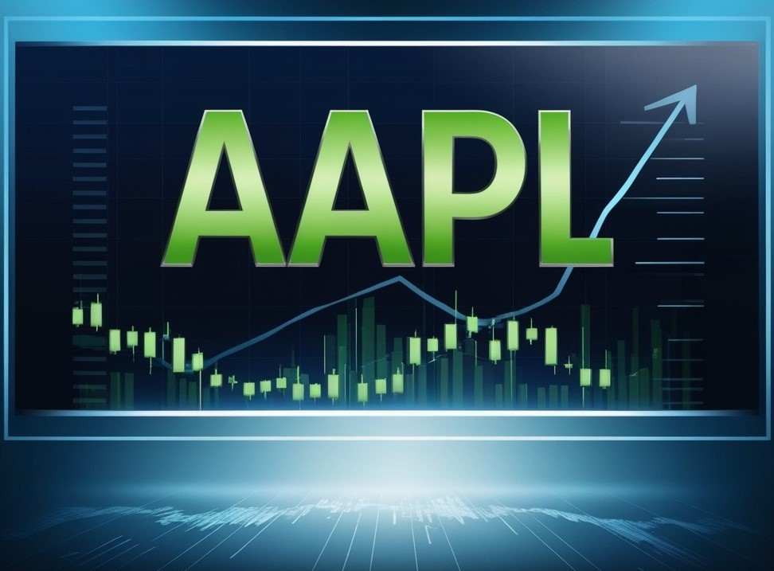

# APPLE-stock-price-prediction


#### Authors
- Simon Makumi
- Esther Njagi
- Kelsey Maina
- Annbellah Nduta

## Introduction
Britam Asset Managers, a leading asset management firm in Kenya, offers a wide range of investment solutions, including portfolio management, equity investments, and financial advisory services. To optimize client returns and enhance their investment strategies, Britam is incorporating accurate forecasts of Apple Inc.’s stock prices into their portfolio management processes. This project aims to develop a time series forecasting model using historical stock price data from the Alpha Vantage API. By integrating these forecasts, Britam seeks to optimize asset allocation, make more informed trading decisions, and provide improved financial advisory services.

## Objective 
The goal is to develop a Time Series forecasting model to predict Apple stock prices using historical data by analyzing stock price trends on a weekly, monthly, and yearly basis to identify patterns and seasonal effects, and by investigating how significant events, such as earnings reports, product launches, or macroeconomic changes, influence Apple stock prices, incorporating these insights into the forecasting model.

## Data
The analysis utilizes historical stock price data for Apple Inc., including information on Apple products, stocks, and interest rates, sourced from the Alpha Vantage API. The main dataset, "apple_stock_and_interest_rates.csv," spans from January 02, 2009, to August 02, 2024, and includes 3921 rows and 8 columns detailing daily stock prices ('Open', 'High', 'Low', 'Close', 'Adj Close'), 'Volume', and 'Interest_Rate'. The "apple_products_2009_to_2024.xlsx" file provides Apple product release dates with 26 rows and 2 columns, while the "competition.csv" file records product release dates from competing companies, also with 26 rows and 2 columns. All datasets were cleaned, with date columns converted to indexes for analysis.

## Modelling
We built:
- Random Forest as the baseline model
- Random Forest with GridsearchCV
- Facebook Prophet
- Facebook Prophet with regressors
- LTSM model.

## Deployment
Included in the repository is a streamlit user interface that serves as the rudimentary method through which users shall interact with our model.

## Additional Documentation
As mentioned before included in this repository is the complete project documentation. This includes:).
* [Write-up documentation](https://github.com/simonMakumi/APPLE-stock-price-prediction/blob/main/AppleStocks_report.docx)


## Setup Instructions

* Install the required packages using pip:

    ```
    pip install -r requirements.txt
    ```

* Install Streamlit:

    ```
    pip install streamlit
    ```

* To run the app locally run the following on terminal:
    ```
    streamlit run app.py
    ```